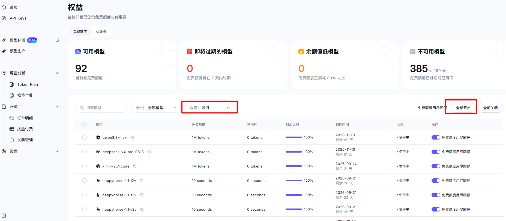

# Boos Agent

> BOSS 直聘根据简历自动投递自动打招呼

在 BOSS 直聘 岗位列表页批量浏览时，自动循环分析每个岗位：用大模型判断岗位与简历的匹配度——**不匹配自动滚动到下一个，匹配则触发提醒并生成打招呼语**，支持自动 / 手动两种打招呼模式，帮你大幅提升刷岗效率。

## 功能特性

- **自动循环分析**：在岗位列表页一键启动，自动逐个抓取并分析岗位，无需手动操作
- **AI 匹配度判断**：基于简历内容，由大模型（Ollama / 千问 / DeepSeek 等任意 OpenAI 兼容 API）判断岗位匹配度并给出分析理由
- **匹配提醒**：匹配到合适岗位时面板高亮 + 提示音
- **双打招呼模式**：
  - **自动模式（默认）**：匹配后自动发送默认招呼语，继续分析下一个岗位
  - **手动模式**：匹配后暂停，展示 AI 生成的打招呼语供一键复制，确认后继续
- **分析记录历史**：自动保存岗位名称 / 详情 / 匹配结论 / AI 理由 / 打招呼状态，上限 500 条自动淘汰最旧
- **简历导入**：直接粘贴文本，或导入 `.md` / `.docx` / `.pdf` 文件（单个 ≤ 5MB）
- **Token 用量统计**：分析过程中实时展示输入 / 输出 token 消耗
- **本地优先**：支持 Ollama 本地模型，简历与配置均存储在本地浏览器，不经过任何第三方服务器

## 技术栈

Chrome Manifest V3 · [Plasmo](https://www.plasmo.com/) 0.90 · React 18 · TypeScript · SCSS（CSS Modules）· [antd](https://ant.design/) 6 · pnpm

## 快速开始

### 1. 安装扩展
[下载压缩包](./boos-agent.zip)，然后在浏览器 `chrome://extensions/` 开启「开发者模式」，点击「加载未打包的扩展程序」，选择 解压后的 目录即可。

### 2. 配置大模型

点击工具栏扩展图标打开配置面板：

- **Ollama**：选择「Ollama」，默认地址 `http://localhost:11434`，点「获取模型」拉取本地模型列表
  - ⚠️ Chrome 扩展访问 Ollama 需要额外配置，见 [Ollama CORS 配置（必读）](#ollama-cors-配置必读)
- **OpenAI 兼容 API**（千问 / DeepSeek 等）：选择「OpenAI 兼容」，可从预设中一键填充服务地址，填写 API Key 后点「获取模型」

#### 千问免费模型
> 对于不想使用本地部署的用户可以使用千问提供的免费模型，每个模型免费1M的token，用完再切其它模型
千问工作台地址：https://platform.qianwenai.com/home/benefits
记得筛选可用模型，把免费额度用尽即停全部打开

### 3. 测试连接

点「测试连接」确认模型服务可达，再进入下一步。

### 4. 导入简历

粘贴简历文本，或拖入 / 选择 `.md` / `.docx` / `.pdf` 文件（单个不超过 5MB）。

### 5. 选择打招呼模式

- **自动打招呼（默认）**：匹配后自动发送并继续分析下一个岗位
- **手动确认**：匹配后暂停，展示 AI 生成的打招呼语供一键复制

> 自动打招呼发送的是 BOSS 直聘账号的**默认招呼语**（可在 BOSS 的「消息通知 → 设置招呼语」中修改）；AI 生成的打招呼语在手动模式下供一键复制。

### 6. 开始分析

打开 BOSS 直聘岗位列表页（需已登录），点「开始分析」，页面右下角浮层会实时展示分析进度；任意时刻可点「停止」。

支持的页面（浮层仅在以下列表页注入，其他页面不出现）：

- 职位推荐列表页：https://www.zhipin.com/web/geek/jobs
- 搜索结果列表页：https://www.zhipin.com/web/geek/job?query=关键词（带任意搜索参数均可）

## Ollama CORS 配置（必读）

Chrome 扩展的请求来源是 `chrome-extension://<扩展ID>`，Ollama 默认不允许跨源访问，必须设置环境变量后重启 Ollama：

1. 在 `chrome://extensions/` 找到本扩展，点「查看详情」复制扩展 ID（形如 `abcdefgh...`）
2. 设置环境变量 `OLLAMA_ORIGINS=chrome-extension://<扩展ID>`
   - Windows 用户：系统设置 → 环境变量 → 新建，变量名 `OLLAMA_ORIGINS`，变量值填上述 chrome-extension:// 地址
3. 重启 Ollama 服务（若正在运行需完全退出后重新启动）
4. 若已添加过历史环境变量（旧名 `OLLAMA_ORIGINS` 或 `OLLAMA_HOST`），以系统设置界面显示为准

**验证**：打开插件 popup → 点「获取模型」→ 能看到本地模型列表即成功。

## 本地开发

环境要求：Node.js 18+、pnpm。

```bash
pnpm install     # 安装依赖
pnpm dev         # 开发构建（watch，输出 build/chrome-mv3-dev）
```

浏览器打开 `chrome://extensions/`，开启开发者模式，加载 `build/chrome-mv3-dev` 目录。修改代码后会自动重新构建，在扩展详情页点「重新加载」即可生效。

### 常用命令

| 命令 | 说明 |
|------|------|
| `pnpm dev` | 开发构建（watch，输出 `build/chrome-mv3-dev`） |
| `pnpm build` | 生产构建（输出 `build/boos-agent`） |
| `pnpm package` | 打包发布产物（zip） |
| `pnpm typecheck` | TypeScript 类型检查（Parcel 不 typecheck，改代码后必跑） |

> 开发注意：多个 `plasmo dev` 实例会互相覆盖产物，启动前先清理旧的 dev 构建。

## 目录结构

```
├── src/
│   ├── popup.tsx                 popup 入口（配置面板薄壳）
│   ├── contents/boos-agent.tsx   content script 入口（仅注入岗位列表页：推荐 /web/geek/jobs、搜索 /web/geek/job）
│   ├── pages/
│   │   ├── popup/                配置面板（antd）：服务 / 模型 / API Key / 简历 / 打招呼模式 / 历史记录
│   │   └── content/              页面右下角浮层（Shadow DOM + CSS Modules）：分析进度、匹配结果、打招呼
│   ├── services/
│   │   ├── llm/                  多 provider 统一客户端（ollama / openai 兼容）
│   │   ├── zhipin/               BOSS 直聘 DOM 抓取（scraper + 反爬 sanitize）
│   │   ├── analysis/             分析引擎（命令式状态机 + 事件驱动）
│   │   ├── storage/              chrome.storage 类型安全封装
│   │   └── history/              分析记录历史（单键存数组 + 500 条上限淘汰）
│   ├── utils/                    纯函数（prompt 构建 / LLM 响应解析 / 简历解析等）
│   ├── constant/                 全局类型、反爬选择器、LLM 预设、循环配置等共享常量
│   └── styles/global.scss        popup 全局样式
└── assets/                       扩展图标等静态资源
```

## 架构简述

- **状态机**：`IDLE → RUNNING → DONE`，匹配时按打招呼模式分支（自动 / 手动暂停等待确认）；任意时刻可停止；页面刷新即重置
- **数据流**：popup 配置改动即保存到 `chrome.storage.local` → 引擎启动时快照配置（循环期间不重读）→ DOM 抓取岗位 → 构建 Prompt（含 few-shot 示例）→ LLM 调用（JSON 格式输出）→ 解析结果 → 事件驱动更新浮层 UI
- **历史闭环**：每次分析结束立即写入历史记录；打招呼决策点补写打招呼结果；popup 历史 Tab 通过 `chrome.storage.onChanged` 实时刷新
- **反爬兼容**：滚动页面触发懒加载、点击卡片加载详情、详情加载完成校验等页面行为策略，站点改版只改 `src/constant/zhipin-selectors.ts`

> 更详细的架构说明与开发备忘见仓库内 `CLAUDE.md`。

## 免责声明

- 本项目**仅供学习研究使用**，与 BOSS 直聘官方无关，亦未经其授权
- 扩展会对 BOSS 直聘页面进行自动化操作，**可能违反其服务条款**，由此产生的账号风险（如风控、封禁）由使用者自行承担
- 自动打招呼使用的是你账号的默认招呼语，请确认招呼语内容符合你的意向
- BOSS 直聘站点改版可能导致功能失效，项目不保证持续维护兼容性

## 许可证

[MIT](./LICENSE) © 2026 HXH
